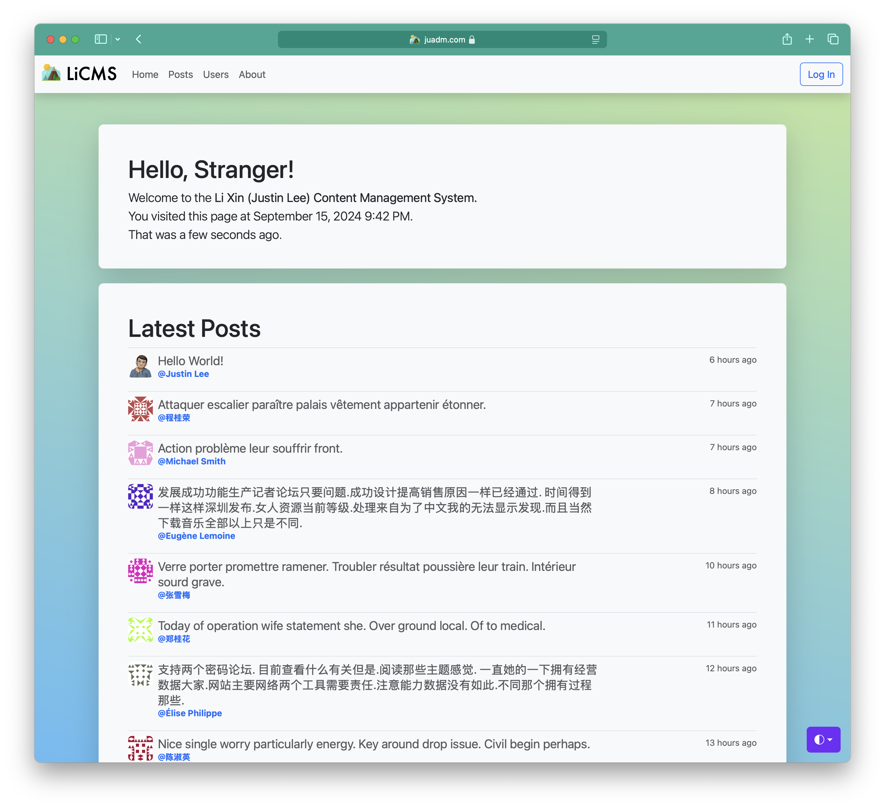

<p align="center"></p>

# LiCMS

LiCMS (Li Xin (Justin Lee) Content Management System) is a content management system used for blogging, implemented with
Flask.

## Requirements

> - Python `3.9.13`
> - Docker `20.10.16`
> - DataBase depending on deployment method (default in `config.py`, cen be edited as you wish)
> - Heroku: `mysql`
> - Docker: `mysql`
> - Unix: `mysql`
> - Test Env: `sqlite`

## Tech Reviews

- LiCMS is an all-in-one content management solution developed with the MVC design pattern, providing usage and
  management for posts, comments, and users.
- For the front-end, we provide both the `RESTful-API` solution and website solution (based on Bootstrap).
- For the back-end, we provide a Flask and Docker-based, automatic deployed and self-sustained solution with
  continuous-integration provided by Jenkins or Travis-CI.
- For database management, I used SQLAlchemy to simplify the complex SQL queries into object operations, which provided
  me with an object-oriented interface for all CRUD operations.
- For continuous integration, I integrated this project with Travis-CI and Jenkins.
- For auto-deploying and self-sustaining, thanks to docker. I achieved these with docker-compose and a self-implemented
  flask CLI extension.
- For Tow Step Verification or 2FA, it's implemented via the `TOTP` (Time-based One-time Password) algorithm.
- For unexpected errors, LiCMS will email the `LICMS_ADMIN` configured in `.env-licms`.
- For enhanced performance, we enabled `gunicorn` multi-threading, it takes (`2 * physical_cpus + 1`) CPUs by
  default, (`hyper-thread` is assumed to be enabled).

## Platform Compatibility (Front-end)

- [x] iOS
- [x] iPadOS
- [x] macOS
- [x] Linux
- [x] Windows

## Platform Compatibility (Back-end)

- [x] macOS
- [x] Linux
- [x] Unix
- [x] Heroku
- [x] Docker
- [x] Windows (Supported via Docker)

## Deployment Guide (Docker-Ubuntu)

If you would like to deploy LiCMS via other methods, you could refer to this guide

> *All Contents in the `<>` should math in each file*
> > Example:  
> > If you replaced `<db_host>` with `example.com` in `.env-licms`, you should replace `<db_host>` with `example.com`
> > every where.

1. First thing first, clone this project.
   ```shell script
   git clone https://github.com/realJustinLee/LiCMS.git
   ```
1. First thing first, you should compose a dot-env file named `.env-licms`.
   > The template is in the following code block:
   > ```text
   > DB_USERNAME=<db_username>
   > DB_PASSWORD=<db_password>
   > DB_HOST=<db_host>
   > DB_PORT=<db_port>
   > DB_DATABASE=<db_database>
   > SECRET_KEY=<a_super_strong_key>
   > LICMS_ADMIN=<your@email.com>
   > LICMS_POSTS_PER_PAGE=20
   > LICMS_USERS_PER_PAGE=50
   > LICMS_COMMENTS_PER_PAGE=30
   > LICMS_SLOW_DB_QUERY_TIME=0.5
   > MAIL_SERVER=smtp.googlemail.com
   > MAIL_PORT=587
   > MAIL_USE_TLS=true
   > MAIL_USERNAME=<your_separate_gmail_account>
   > MAIL_PASSWORD=<your_separate_gmail_application_password>
   > FLASK_APP=app.py
   > FLASK_CONFIG=docker
   > PREFERRED_URL_SCHEME=https
   > ```
1. Then you will need to compose another dot-env file named `.env-mysql`.
   > The template is in the following code block:
   > ```text
   > MYSQL_RANDOM_ROOT_PASSWORD=yes
   > MYSQL_DATABASE=<db_database>
   > MYSQL_USER=<db_username>
   > MYSQL_PASSWORD=<db_password>
   > ```
1. After words, replace all the `licms.example.com` with your own host like `some-host.someone.com`. In the Following
   file:
    - `.conf/nginx/app.conf`
    - `init_letsencrypt.sh`
      > please replace `<your@email.com>` in this file with the email you replaced `<your@email.com>` in `.env-licms`
      with.
1. Run the following code to deploy the project.
    ```shell
    # install docker-ce for ubuntu
    ./init_ubuntu_dokcer_ce.sh
    reboot
    cd /path/to/LiCMS
    ./init_letsencrypt.sh
    ./post_reboot.sh
    ```

## RESTful API auth flow

1. POST `https://your.host/api/v1/tokens/` with HTTP Basic Auth:
    ```text
    Username:<email>    
    Password:<password>
    ```
1. It will return a JSON body with `token` and `expiration` like this:
    ```json
    {
        "expiration": 600,
        "token": "<token>"
    }
    ```
1. Before the token expires, you could visit other apis with HTTP Basic Auth via the token you requested.
   > The token takes the place of `Username` and leave `Password` empty.
    ```text
    Username:<token>    
    Password:
    ```

## DB Migrations !!! Caution !!!

If you wanna maintain your own impl of database, or you've altered the db models, you need to do db migrations or db
inits.

1. DB init:
    ```shell
    flask db init
    ```
1. DB upgrade:
    ```shell
    flask db upgrade
    ```
1. DB migrate:
    ```shell
    flask db migrate
    ```

## Dev Hacks

If you run LiCMS in `development` mode, and you would like to fake some users, posts, comments, etc. Do the following.

1. First enter `Flask Shell`:
    ```shell script
    flask shell
    ```
1. Import `fake` form `app_core`:
    ```python
    from app_core import fake
    ```
1. Fake 100 random Users:
    ```python
    fake.users(100)
    ```
1. Fake 100 random Posts for random Users:
    ```python
    fake.posts(100)
    ```
1. Fake 100 random Comments for random Posts by random Users:
    ```python
    fake.comments(100)
    ```
1. Fake 100 random Follows for random Users followed by random Users:
    ```python
    fake.follows(100)
    ```

## Screen Shots

The Screenshot


## TODO

- [ ] Paste bin for Academic use.
- [ ] OAuth Sign In (Sign In with twitter/facebook/google/apple).
- [x] About page.
- [x] Migrate to Bootstrap5

# Made with ❤ by [Justin Lee](https://github.com/realJustinLee)!

™ and © 2022 Justin Lee. All Rights Reserved. [License Agreement](./LICENSE)
